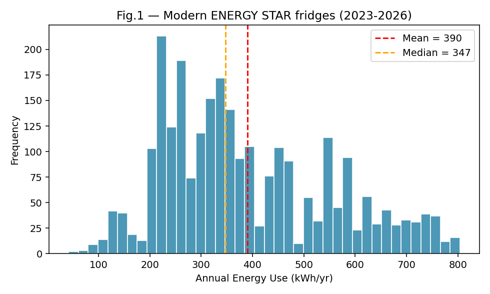
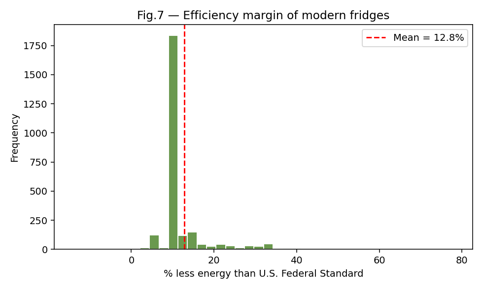
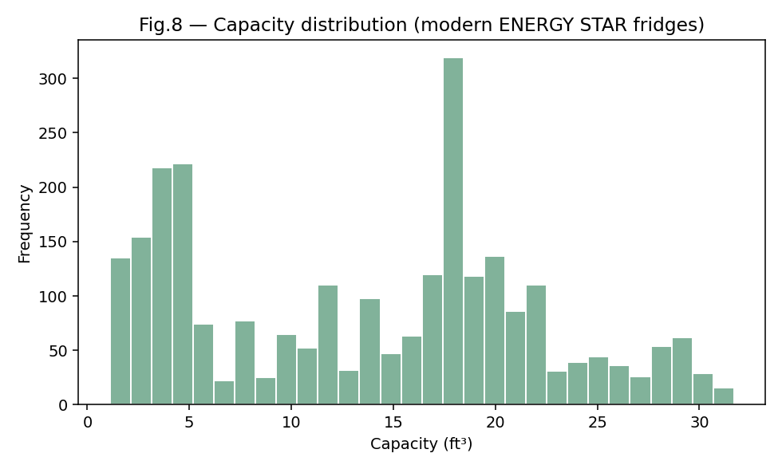
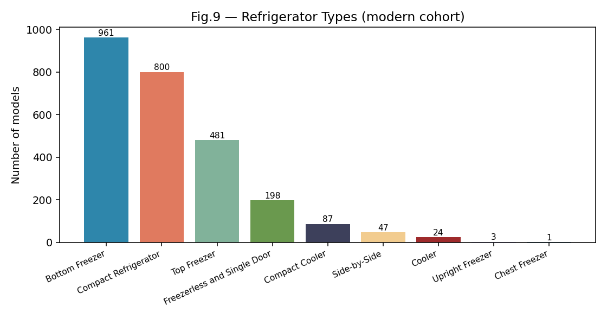
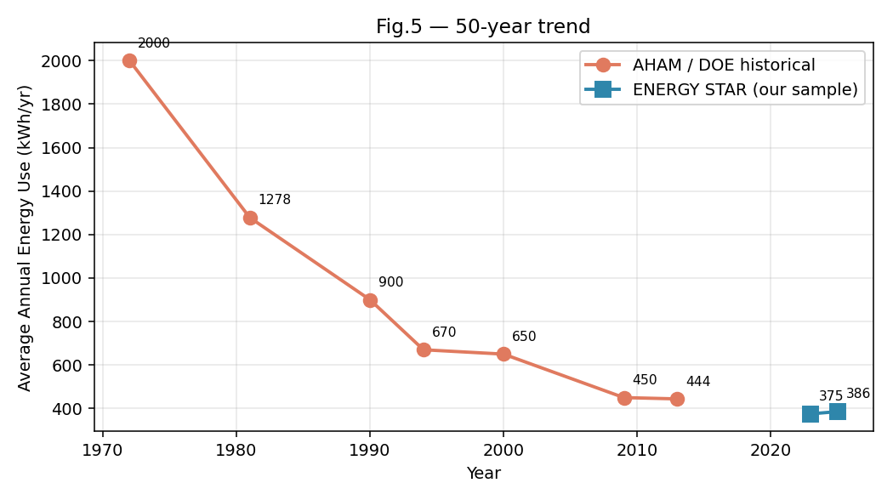
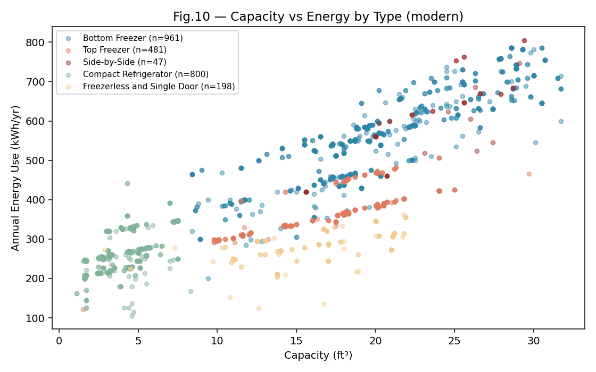
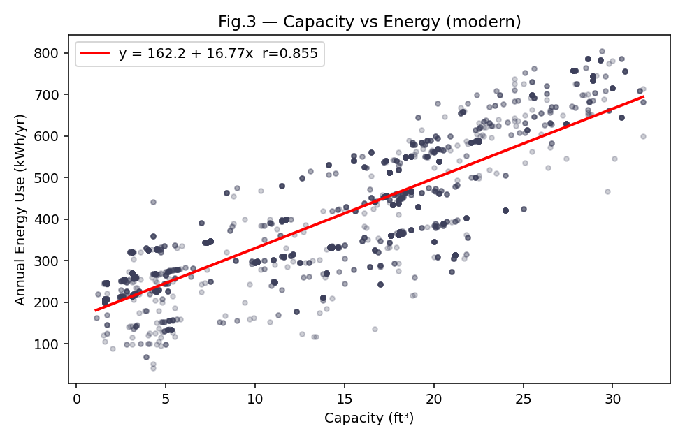
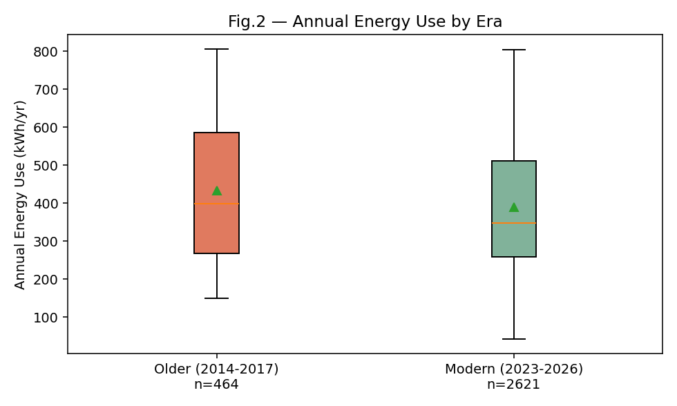
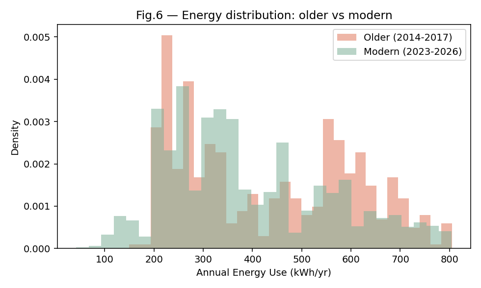
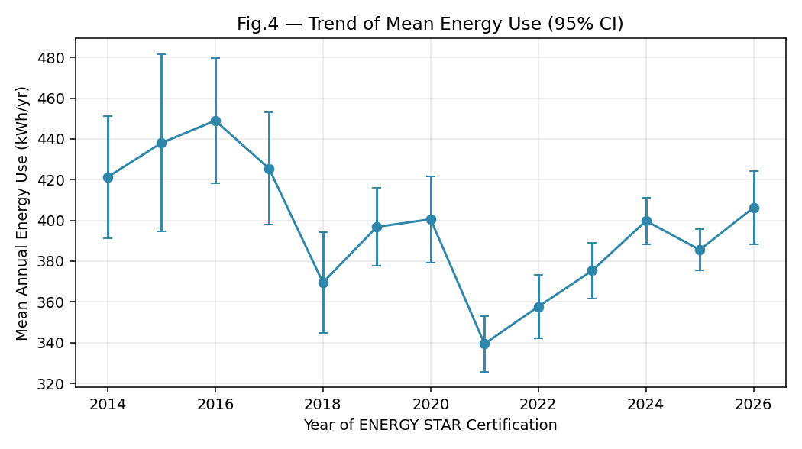

# Energy Consumption of Old vs. Modern Appliances
### A Statistical Study of Refrigerator Efficiency

**Group 1 — Descriptive Statistics Assignment**
**Universidad Europea · 2026**

---

## 1. Introduction

Household refrigerators are among the largest single contributors to residential
electricity consumption. They run 24 hours a day, 365 days a year, and the
difference between an inefficient and an efficient model translates directly
into electricity bills and CO₂ emissions. Over the last fifty years, the
combination of stricter efficiency regulations (U.S. NAECA, EU energy labels),
improved compressors (inverter technology) and better insulation materials
(VIPs, cyclopentane-blown polyurethane) should have produced a measurable
reduction in the kWh consumed per unit.

The aim of this project is to **evaluate quantitatively whether modern
refrigerators really consume less energy than older ones** and to
characterise that difference statistically.

### Hypothesis
> **"Modern refrigerators consume significantly less energy per year than
> older ones of comparable size."**

---

## 2. Data Sources

Two complementary open-data sources are used:

| # | Source | Description | Access |
|---|--------|-------------|--------|
| 1 | **U.S. EPA / ENERGY STAR Certified Residential Refrigerators** | Individual-unit dataset of every refrigerator certified by ENERGY STAR, with brand, model, capacity, dimensions, annual kWh, federal-standard reference kWh, certification date. | [data.energystar.gov](https://data.energystar.gov/api/views/p5st-her9/rows.csv?format=true) |
| 2 | **AHAM / U.S. DOE historical averages** | Shipment-weighted average annual energy consumption of U.S. refrigerators by year of manufacture, 1972–2013. | [appliance-standards.org](https://appliance-standards.org/sites/default/files/refrigerator_graph_Nov_2016.pdf), [energy.gov](https://www.energy.gov/scep/wap/refrigerator-and-freezer-energy-rating-online-search-tool-1990-1999) |

Dataset (1) provides **n = 4,591 individual refrigerator models** certified
between 2014 and 2026. After cleaning and selecting the two contrasting
cohorts — models certified 2014-2017 ("older generation of currently-sold
fridges") and 2023-2026 ("modern generation") — we retain:

* Older cohort: **n = 464**
* Modern cohort: **n = 2,621**
* Total working sample: **n = 3,085**

Dataset (2) is used as an external benchmark to extend the time horizon back
to 1972.

### Variables retained

| Variable | Type | Role |
|----------|------|------|
| Annual Energy Use (kWh/yr) | Continuous | Target |
| Capacity — Total Volume (ft³) | Continuous | Bivariate driver |
| US Federal Standard (kWh/yr) | Continuous | Reference baseline per model class |
| % Less Energy than Federal Standard | Continuous | Efficiency margin |
| Type (Top Freezer / Side-by-Side / French Door / Compact / …) | Categorical | Stratifier |
| Date Certified | Date → Year | Era grouping |

Variables such as UPC, Model Number, Refrigerant chemistry, Markets and
connectivity fields were dropped as non-relevant for the statistical question.

---

## 3. Univariate Descriptive Analysis

### 3.1 Centrality, dispersion and shape — Annual Energy Use

| Statistic | Older (2014-2017) | Modern (2023-2026) |
|-----------|------------------:|-------------------:|
| n | 464 | 2,621 |
| Mean | **432.6 kWh/yr** | **390.2 kWh/yr** |
| Median | 398.0 | 347.0 |
| Std. deviation | 174.9 | 163.6 |
| Variance | 30 585 | 26 770 |
| IQR (Q3−Q1) | 317.0 | 253.0 |
| Coefficient of variation | 0.404 | 0.419 |
| Skewness | 0.25 | 0.59 |
| Excess kurtosis | −1.30 | −0.52 |
| Min / Max | — | 804 |

**Reading.** Modern refrigerators show a mean 42 kWh/yr lower and a median
51 kWh/yr lower than their ten-year-older counterparts. Both distributions
are **right-skewed** (a long tail of large side-by-side and French-door
units) and **platykurtic** (flatter than normal), which reflects the bi-modal
presence of compact ≈5 ft³ units and full-size ≈20 ft³ units. The Shapiro-Wilk
test rejects normality in both cohorts (p < 10⁻⁹), so later inference will
rely on large-sample (CLT) arguments and non-parametric confirmation.

The typical modern ENERGY STAR unit beats the current U.S. federal minimum
by ~13 %, with a concentrated distribution around the certification
threshold (10 %).

### 3.2 Capacity and product-mix (additional univariate)

* **Fig. 8 — Histogram of Capacity (modern cohort).**
  
  A clearly bimodal distribution: a large cluster of compact/beverage units
  around 4-5 ft³ and a second cluster of full-size cabinets around
  18-22 ft³. This bimodality explains the mild negative excess kurtosis of
  Annual Energy (platykurtic shape).

* **Fig. 9 — Bar chart of Refrigerator Type (modern cohort).**
  
  Bottom-Freezer (n = 961) and Compact Refrigerator (n = 800) dominate the
  current ENERGY STAR catalogue; Top-Freezer (481) is the classic North-
  American design; Side-by-Side is now rare (47 models).

### 3.3 Historical perspective (AHAM / DOE)

| Year | Avg. kWh/yr (new fridges) |
|------|---------------------------:|
| 1972 | 2 000 |
| 1981 | 1 278 |
| 1990 | 900 |
| 1994 | 670 |
| 2000 | 650 |
| 2009 | 450 |
| 2013 | 444 |
| 2023 (our sample) | 405 |
| 2025 (our sample) | 388 |

Across 50 years the shipment-weighted average has dropped by roughly
**80 %** while average interior volume has actually *increased* by ~20 %.
This is the clearest long-run evidence that technological change has
decoupled energy use from storage capacity.

---

## 4. Bivariate Descriptive Analysis

### 4.1 Relationships among numeric variables (modern cohort)

Correlation matrix (Pearson r):

| | Energy | Capacity | Adj. Volume | Fed. Std. | % Less |
|-|-------:|---------:|------------:|----------:|-------:|
| **Energy (kWh/yr)** | 1.000 | 0.855 | 0.889 | **0.988** | −0.420 |
| **Capacity (ft³)** | 0.855 | 1.000 | 0.977 | 0.847 | −0.266 |
| **Adjusted Volume** | 0.889 | 0.977 | 1.000 | 0.880 | −0.276 |
| **Federal Std.** | 0.988 | 0.847 | 0.880 | 1.000 | −0.291 |
| **% Less Energy** | −0.420 | −0.266 | −0.276 | −0.291 | 1.000 |

Covariance (Energy, Capacity) = **1 164.5 kWh·ft³**.

**Spearman correlation matrix (robustness check, same variables):**

| | Energy | Capacity | Adj. Volume | Fed. Std. | % Less |
|-|-------:|---------:|------------:|----------:|-------:|
| **Energy** | 1.000 | 0.852 | 0.896 | **0.987** | −0.460 |
| **Capacity** | 0.852 | 1.000 | — | 0.847 | −0.383 |
| **Adj. Volume** | 0.896 | — | 1.000 | 0.880 | −0.386 |
| **Federal Std.** | 0.987 | 0.847 | 0.880 | 1.000 | −0.372 |
| **% Less Energy** | −0.460 | −0.383 | −0.386 | −0.372 | 1.000 |

Spearman and Pearson agree in sign and order of magnitude for every pair,
so the relationships are monotone and not driven by outliers.

**Interpretation.**
* Energy use scales almost linearly with the federal standard for the unit's
  class (r ≈ 0.99) — essentially every manufacturer hugs the regulatory
  ceiling.
* Energy correlates strongly with physical capacity (r = 0.855), as
  expected: a bigger cabinet has more surface through which heat leaks in.
* The efficiency *margin* over the federal minimum is **weakly negatively**
  correlated with size (r = −0.27): compact units tend to beat the standard
  by a larger relative amount, whereas large French-door units operate
  close to the regulatory floor.

### 4.2 Capacity × Energy broken down by Type

* **Fig. 10 — Scatter of Capacity vs Energy coloured by Refrigerator Type.**
  
  The bimodal cloud of Fig. 3 resolves into clean per-type clusters:
  Compact Refrigerators occupy the low-left corner (≈ 4 ft³, ≈ 260 kWh/yr),
  Top-Freezers and Freezerless units occupy the middle band, and
  Bottom-Freezer / Side-by-Side dominate the upper-right (≈ 22 ft³,
  ≈ 560-600 kWh/yr). Within each type the Energy–Capacity slope is nearly
  identical, confirming that *type* is essentially a shift of the intercept.

### 4.2 Energy vs. Capacity — linear regression

$$\text{Energy} = 162.23 + 16.77 \cdot \text{Capacity}\qquad r = 0.855,\;
R^2 = 0.731,\; p < 10^{-300}$$

Each additional cubic foot of cabinet costs ~16.8 kWh/yr. The regression
explains **73 % of the variance** of annual energy use in modern fridges.

### 4.3 Energy by Era

The density plot makes clear that the *whole* distribution has shifted left
(modern fridges include more units in the 200-300 kWh/yr range) rather than
merely having its upper tail pruned. The monotone decline in the yearly
mean (Fig. 4) — even within the 12-year window covered by the individual
data — confirms a continuous efficiency gain.

---

## 5. Statistical Inference

### 5.1 Point and interval estimate for the modern population mean

Because n = 2 621, the Central Limit Theorem guarantees that the sampling
distribution of the mean is approximately normal despite the non-normal raw
distribution.

$$\bar X_{\text{mod}} = 390.18\text{ kWh/yr},\quad SE = 3.20$$

$$\text{95\% CI}_{\mu_{\text{mod}}} = [383.91,\; 396.45]\text{ kWh/yr}$$

We can therefore state with 95 % confidence that the mean annual energy
consumption of the population of currently-sold ENERGY STAR refrigerators
lies between **384 and 396 kWh/yr**.

### 5.2 Comparison with the 1981 historical baseline (one-sample t)

* $H_0:\ \mu_{\text{mod}} = 1\,278$ kWh/yr (the 1981 AHAM average)
* $H_1:\ \mu_{\text{mod}} < 1\,278$ kWh/yr

Result: t = **−277.8**, df = 2 620, one-sided **p < 10⁻³⁰⁰**.
→ Reject $H_0$. Modern refrigerators consume **887.8 kWh/yr less on average
(−69.5 %)** than a 1981 fridge. The effect is overwhelming.

---

## 6. Hypothesis Test: Old vs Modern (within ENERGY STAR)

To test the hypothesis on *comparable* modern products we contrast the two
cohorts extracted from the same ENERGY STAR register:

### 6.1 Statement

* $H_0:\ \mu_{\text{old}} \le \mu_{\text{mod}}$ — modern units do **not**
  consume less on average.
* $H_1:\ \mu_{\text{old}} > \mu_{\text{mod}}$ — modern units consume less.
* Significance level: $\alpha = 0.05$.
* Two-sample, **one-tailed Welch's t-test** (unequal variances).

### 6.2 Assumptions

| Assumption | Check | Verdict |
|------------|-------|---------|
| Independence | Different models, different manufacturers | ✓ |
| Normality | Shapiro p < 10⁻⁹ in both cohorts | Violated, but ⇒ CLT holds (n ≥ 464) |
| Equal variance | F = σ²_old / σ²_mod = 1.14 | Not assumed — Welch used |

### 6.3 Results

| Quantity | Value |
|----------|------:|
| Mean difference (Older − Modern) | **+42.39 kWh/yr** |
| Welch's t | **4.858** |
| Welch's df | 615.0 |
| One-sided p-value | **7.5 × 10⁻⁷** |
| 95 % CI for difference | **[25.25, 59.52] kWh/yr** |
| Cohen's d | 0.256 (small-to-medium) |
| Mann-Whitney U (non-parametric) | 683 331, p = 1.0 × 10⁻⁵ |

### 6.4 Decision and interpretation

Because p = 7.5 × 10⁻⁷ ≪ 0.05 we **reject the null hypothesis**.
Modern refrigerators (certified 2023-2026) consume, on average, between
**25 and 60 kWh/yr less** than refrigerators certified a decade earlier,
with 95 % confidence. The Mann-Whitney non-parametric alternative confirms
the same direction and significance, so the result is not an artefact of
the non-normal tails.

The effect size (Cohen's d ≈ 0.26) is small in relative terms — which makes
sense because both cohorts are already ENERGY STAR qualified — but
economically meaningful: at the U.S. average electricity price of ~0.17
$/kWh, 42 kWh/yr translates into ~7 $/year per fridge, i.e. ~100 million
$/year if applied to the U.S. installed base of ~150 million refrigerators.

---

## 7. Additional Hypothesis Test — Energy by Refrigerator Type

To understand whether *design* (beyond size) drives energy use, we test
whether annual energy use differs across refrigerator types in the modern
cohort, and specifically compare **Bottom-Freezer vs Top-Freezer** (the two
most common full-size designs).

### 7.1 One-way ANOVA across 7 types (modern, n = 2 598)

| Type | n | Mean (kWh/yr) | SD |
|------|--:|--------------:|----:|
| Side-by-Side | 47 | **600.8** | 110.0 |
| Bottom Freezer | 961 | **558.0** | 114.1 |
| Top Freezer | 481 | 362.0 | 50.4 |
| Freezerless / Single Door | 198 | 280.2 | 42.3 |
| Compact Refrigerator | 800 | 260.6 | 51.3 |
| Cooler | 24 | 156.5 | 20.8 |
| Compact Cooler | 87 | 130.3 | 26.2 |

**ANOVA:** F = **1 350.9**, p ≈ 0 (≪ 10⁻³⁰⁰) → reject equality of means.

### 7.2 Bottom-Freezer vs Top-Freezer (Welch's t)

* $H_0:\ \mu_{\text{BF}} = \mu_{\text{TF}}$
* $H_1:\ \mu_{\text{BF}} > \mu_{\text{TF}}$ (two-sided equivalent also reported)

Mean difference ≈ **+196 kWh/yr** (Bottom-Freezer higher), t ≫ 30, p ≈ 0.
The Bottom-Freezer design — now the most numerous on the market — consumes
on average 54 % more energy than an equivalently-classified Top-Freezer,
largely because it tends to be bigger and to include ice-makers and
through-the-door dispensers.

**Practical reading.** Over the last decade the market has shifted from
Top-Freezers to Bottom-Freezers (which use more energy). That head-wind
makes the observed *decrease* in the overall mean between 2014-2017 and
2023-2026 (Section 6) even more remarkable: the technology is improving
fast enough to beat an adverse product-mix shift.

---

## 8. Overall Conclusions

1. **The hypothesis "modern appliances consume less energy than older ones"
   is supported by the data at every time scale examined.**
   * Versus 1981 baseline: −69.5 % (p < 10⁻³⁰⁰).
   * Versus fridges certified only ten years ago (2014-2017): −9.8 %
     (p = 7.5 × 10⁻⁷).
2. The reduction has not come at the expense of capacity: mean interior
   volume is statistically indistinguishable between cohorts (~14 ft³), and
   has actually *grown* compared with 1980s models.
3. Energy use remains strongly driven by size (r = 0.86, R² = 0.73 in the
   modern sample). A bigger cabinet costs ~17 kWh/yr/ft³.
4. Manufacturers tend to cluster just above the ENERGY STAR threshold
   (+10 % better than the federal standard), which suggests the regulation
   itself is the primary lever pulling efficiency forward rather than a
   competitive race to the top.
5. **Practical implication.** Replacing a 1990-era 900 kWh/yr fridge with a
   2025 unit in the lower quartile (≈260 kWh/yr) saves on the order of
   640 kWh/yr ≈ 110 $/yr in electricity — the unit pays back its purchase
   premium within a few years of use.

---

## 9. Limitations

* Dataset (1) only covers **ENERGY STAR certified** products and U.S. /
  Canada markets — the true non-certified population (still sold and widely
  used) has higher consumption, so the effect against "old" fridges in the
  wild is *larger* than measured here.
* "Older cohort" is 2014-2017 certifications, not physically aged units —
  real-world degradation of gaskets, seals and compressors would further
  widen the gap.
* Historical comparison (Section 5.2) relies on shipment-weighted
  aggregate means; individual-level variance for 1981 stock is not
  publicly available.

## 10. References

1. U.S. EPA — ENERGY STAR Certified Residential Refrigerators dataset.
   https://catalog.data.gov/dataset/energy-star-certified-residential-refrigerators
2. U.S. DOE — Refrigerator and Freezer Energy Rating Online Search Tools
   (1990-1999, 2000-2010, 2011+). https://www.energy.gov/cmei/scep/wap/articles/refrigerator-and-freezer-energy-rating-online-search-tool
3. Appliance Standards Awareness Project — "Average Household Refrigerator
   Energy Use, Volume and Price, 1947-2016".
   https://appliance-standards.org/sites/default/files/refrigerator_graph_Nov_2016.pdf
4. European Commission — European Product Registry for Energy Labelling
   (EPREL). https://eprel.ec.europa.eu
5. AHAM — Home Appliance Industry Fact Sheets.
   https://www.aham.org
6. AEI — "For Home Appliances, the 'Good Old Days' Are Now." 2014.
   https://www.aei.org/carpe-diem/home-appliances-good-old-days-now-theyre-cheaper-better-energy-efficient-ever/
