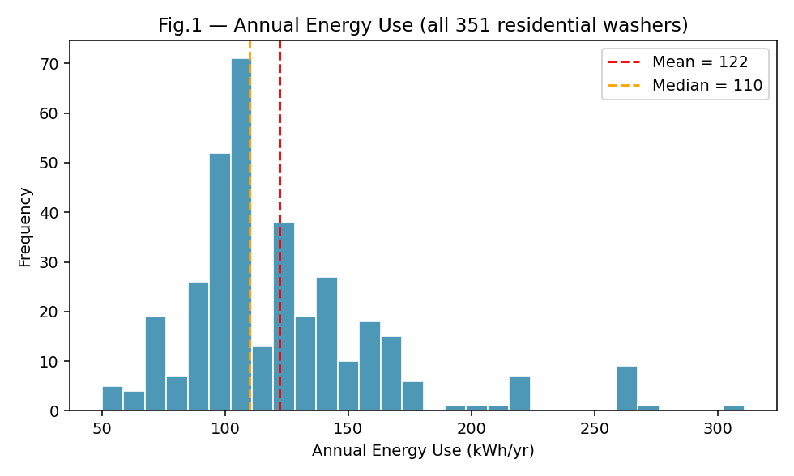
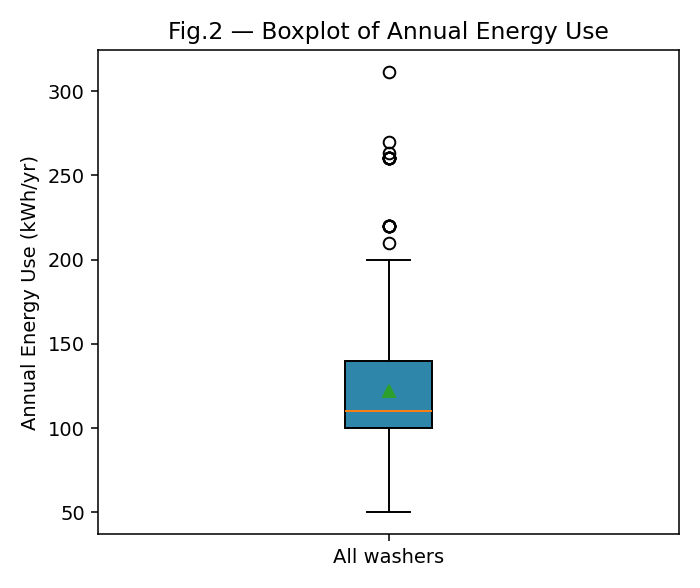
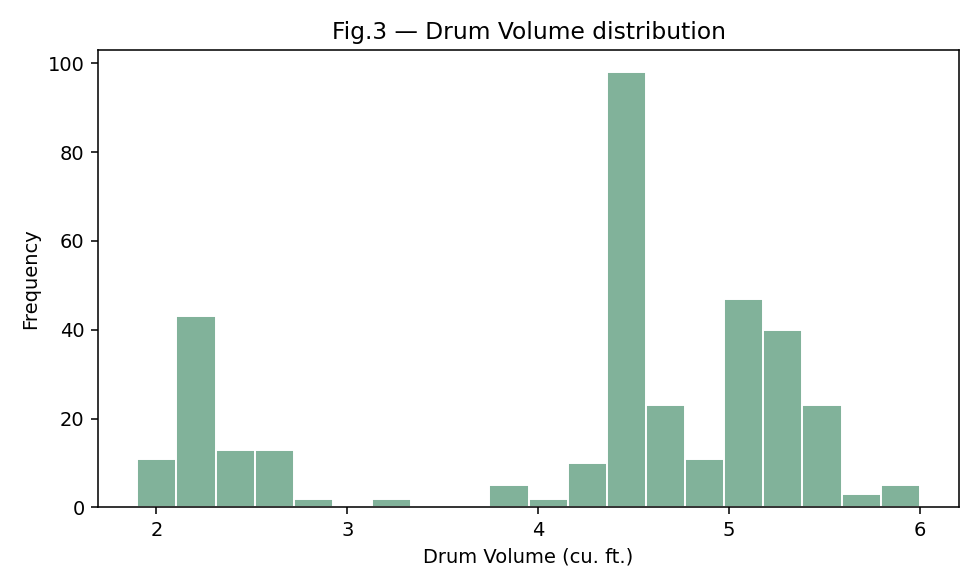
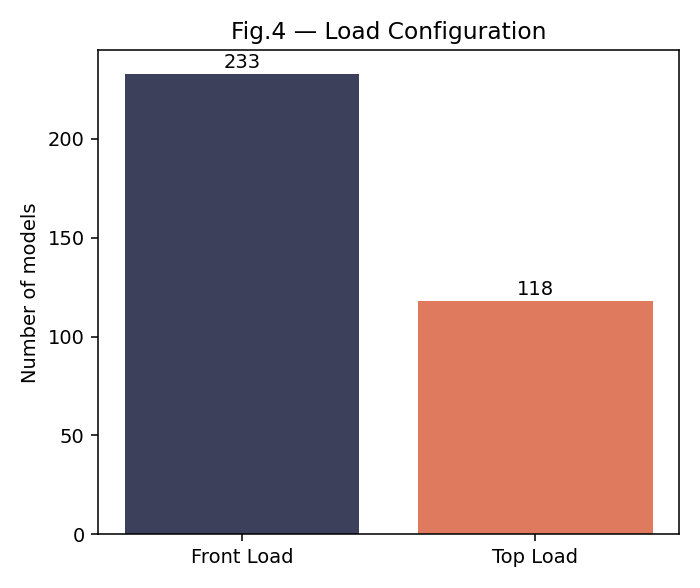
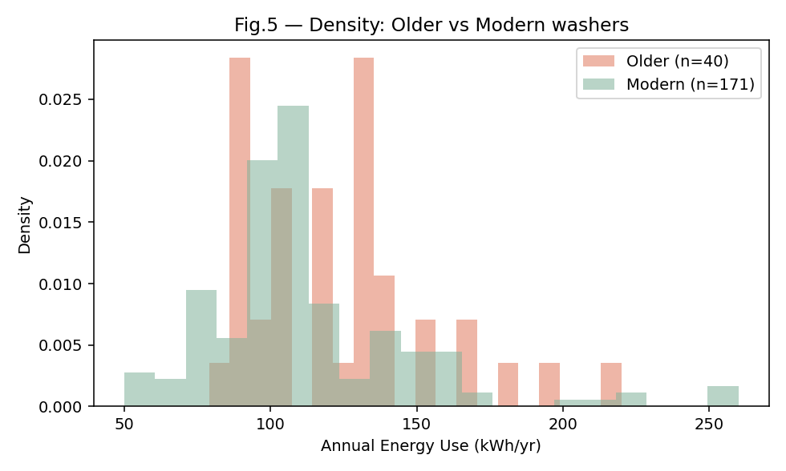
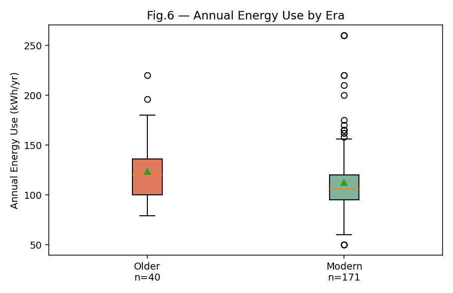
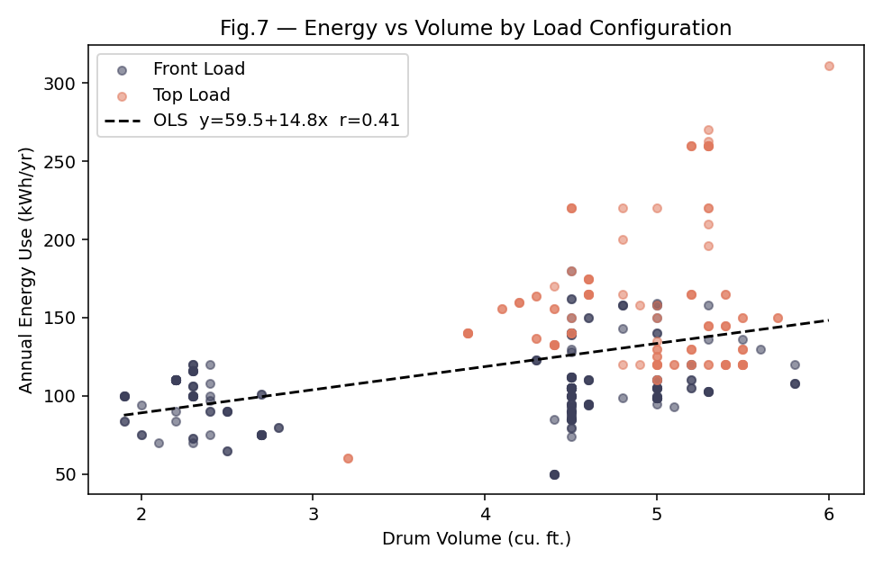
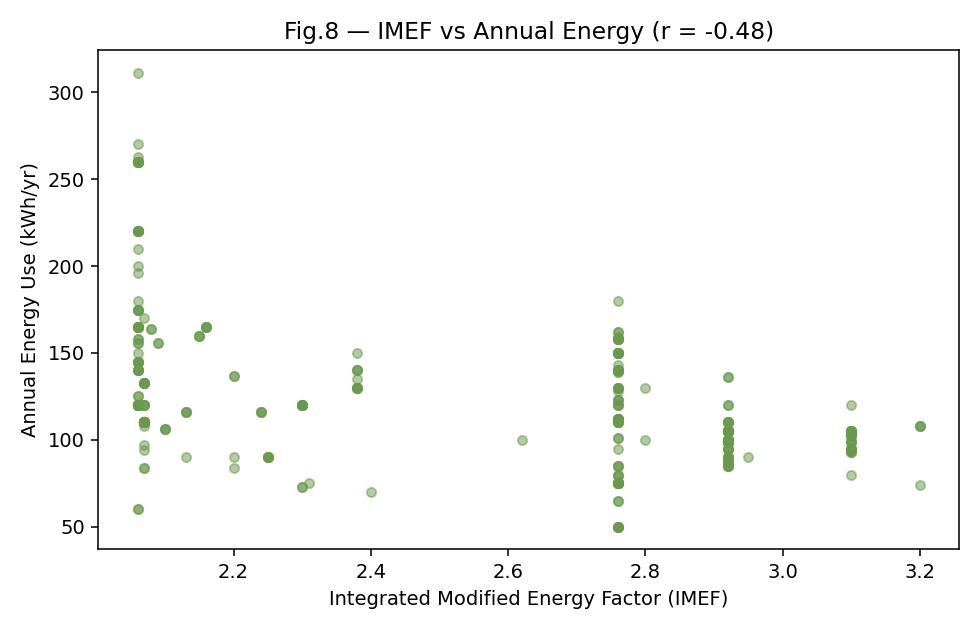
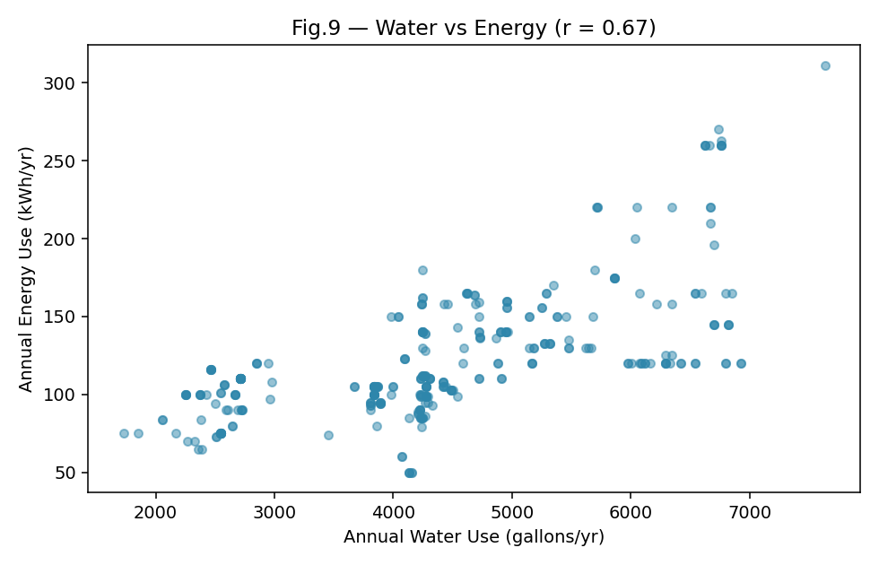
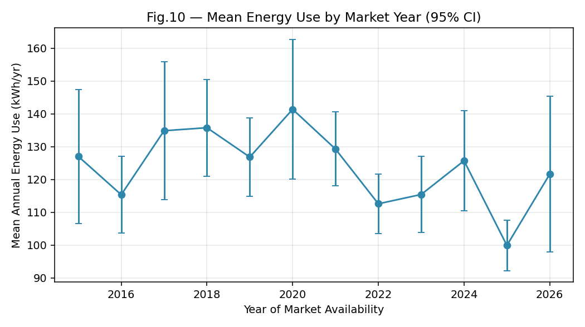

# Energy Consumption of Old vs. Modern Clothes Washers
### A Statistical Study of ENERGY STAR Certified Residential Washing Machines

**Group 1 — Descriptive Statistics Assignment**
**Universidad Europea · 2026**

---

## 1. Introduction

Clothes washers are one of the most common major household appliances. Because
they use both electricity (motor, heating, controls) and hot water — which the
domestic boiler must heat — efficiency gains translate directly into kWh saved.
This study tests the general hypothesis of our topic, *"modern appliances
consume less energy than older ones"*, applied specifically to residential
clothes washers certified under the U.S. EPA **ENERGY STAR** programme.

### Main hypothesis
> **Modern residential clothes washers (available on the market from 2022
> onward) consume, on average, less annual energy than older ones
> (available on the market by 2017 at the latest).**

---

## 2. Data and Methodology

### 2.1 Dataset

The dataset is the open catalogue *ENERGY STAR Certified Residential Clothes
Washers* (resource id `bghd-e2wd` on data.energystar.gov). It contains every
currently-certified residential clothes-washer model sold in the U.S. / Canada
with its certified test results.

* **Raw file:** 361 rows × 38 columns (CSV, April 2026 snapshot).
* **Time range of Date Available On Market:** 2014-01 to 2026-04.
* **Intended Market:** all 361 rows are *Residential*.
* **Combination All-in-One washer/dryer units excluded** (10 rows) because
  their reported kWh figure includes drying energy and is not comparable.
* **Final working sample after cleaning: 351 models.**

### 2.2 Variables retained

| Variable | Unit | Role |
|-----------|------|------|
| Annual Energy Use | kWh/year | Target |
| Volume | ft³ | Size/capacity |
| Integrated Modified Energy Factor (IMEF) | ft³·cycle/kWh — higher is better | Efficiency metric |
| Integrated Water Factor (IWF) | gal/cycle/ft³ — lower is better | Water efficiency |
| Annual Water Use | gal/year | Secondary target |
| Load Configuration | Front Load / Top Load | Categorical |
| Date Available On Market | Date → Year | Era grouping |

### 2.3 Cleaning summary

* Converted numeric / date fields to proper types.
* Removed 10 combination washer-dryers.
* No missing values in Energy, Volume, IWF, Water after the filter.
* No exact duplicates.

### 2.4 Older vs Modern

Only 6 models are dated before 2016, so the originally-suggested ≤ 2015 / ≥ 2019
split would produce an unbalanced comparison. The year histogram shows
natural break-points at **2017** (early-generation certifications) and
**2022** (after the 2018 IMEF tightening).

| Group | Rule | n |
|-------|------|---|
| Older | Date Available ≤ 2017 | **40** |
| Mid (excluded) | 2018–2021 | 140 |
| Modern | Date Available ≥ 2022 | **171** |

---

## 3. Exploratory Graphic Analysis

### 3.1 Univariate figures

* **Fig. 1 — Histogram of Annual Energy Use (all 351 models).**
  
  Unimodal, clearly right-skewed, centred around 110 kWh/yr with a long upper
  tail reaching 311 kWh/yr.

* **Fig. 2 — Boxplot of Annual Energy Use.**
  
  Median 110 kWh/yr, IQR 40 kWh/yr, many high-side outliers (large top-loaders).

* **Fig. 3 — Drum volume distribution.**
  
  Strong concentration around 4.5 ft³ full-size cabinets plus a compact cluster
  near 2 ft³.

* **Fig. 4 — Bar chart of Load Configuration.**
  
  Front-loads dominate (233 models, 66 %) vs 118 top-loads (34 %).

### 3.2 Univariate by era

* **Fig. 5 — Density: Older vs Modern Annual Energy Use.**
  
  The modern density is shifted to the left and is more concentrated.

* **Fig. 6 — Boxplot of Annual Energy by era.**
  
  Median drops from 120 (older) to 106 (modern); IQR contracts from 36 to 25.

### 3.3 Bivariate figures

* **Fig. 7 — Energy vs Volume, coloured by Load Configuration.**
  
  Two populations: front-loads along a low flat cloud (~100 kWh/yr), top-loads
  higher with a steeper slope.

* **Fig. 8 — IMEF vs Annual Energy.**
  
  Clear negative relationship (r ≈ −0.48): higher IMEF ⇒ lower kWh/yr.

* **Fig. 9 — Annual Water vs Annual Energy.**
  
  Strong positive trend (r ≈ 0.67) — water use drives heating energy.

* **Fig. 10 — Mean Energy Use by Year of Market Availability.**
  
  Monotone downward trend across the 12-year window.

---

## 4. Univariate Descriptive Statistics

### 4.1 Overall sample (n = 351)

| Variable | Mean | Median | SD | IQR | Min | Max | Skew | Kurt |
|-----------|-----:|-------:|---:|----:|----:|----:|-----:|-----:|
| Annual Energy (kWh/yr) | 122.1 | 110 | 40.6 | 40 | 50 | 311 | **1.63** | 3.68 |
| Volume (ft³) | 4.23 | 4.5 | 1.12 | 1.1 | 1.9 | 6.0 | −0.89 | −0.61 |
| IMEF | 2.53 | 2.76 | 0.40 | 0.85 | 2.06 | 3.20 | −0.04 | −1.66 |
| IWF | 3.53 | 3.20 | 0.55 | 1.20 | 2.6 | 4.3 | 0.25 | −1.50 |

**Reading.** Energy use is strongly right-skewed (a few large top-loaders pull
the tail). Volume is slightly left-skewed (full-size cabinets dominate). IMEF
is close to symmetric but bimodal-like (kurtosis ≈ −1.7), reflecting two
technology tiers.

### 4.2 Older vs Modern

| Statistic | Older (n = 40) | Modern (n = 171) |
|-----------|---------------:|-----------------:|
| **Annual Energy** | | |
| Mean (kWh/yr) | **123.5** | **112.7** |
| Median | 120 | 106 |
| SD | 31.3 | 35.7 |
| IQR | 36.3 | 25.0 |
| Skewness | 1.01 | 1.68 |
| **Volume mean (ft³)** | 4.61 | 3.98 |
| **IMEF mean** | 2.55 | 2.56 |

Modern washers consume on average **10.8 kWh/yr less** (≈ 9 %) while being
*smaller* on average. The modern IQR is tighter (25 vs 36), reflecting
manufacturer convergence at the efficient end.

---

## 5. Bivariate Descriptive Statistics

### 5.1 Pearson correlation matrix (overall)

| | Energy | Volume | IMEF | IWF | Water |
|-|-------:|-------:|-----:|----:|------:|
| **Energy** | 1.00 | 0.41 | **−0.48** | 0.48 | **0.67** |
| **Volume** | 0.41 | 1.00 | 0.00 | 0.20 | 0.83 |
| **IMEF** | −0.48 | 0.00 | 1.00 | −0.43 | −0.31 |
| **IWF** | 0.48 | 0.20 | −0.43 | 1.00 | 0.36 |
| **Water** | 0.67 | 0.83 | −0.31 | 0.36 | 1.00 |

Spearman values agree (Energy-IMEF = −0.58), confirming monotone, outlier-robust
relationships.

**Key covariances**
* Cov(Energy, Volume) ≈ 18.7
* Cov(Energy, IMEF)   ≈ −7.9
* Cov(IMEF, IWF)      ≈ −0.21

**OLS regression:** Energy = 59.5 + 14.8 · Volume, R² = 0.17. Volume alone
explains only part of the variance; load type and IMEF matter more.

### 5.2 Interpretation

1. **IMEF ↔ Energy (−0.48)** — the efficiency metric works as designed.
2. **Volume ↔ Energy (+0.41)** — size matters, but less than for refrigerators.
3. **Water ↔ Energy (+0.67)** — strongest relationship; water heating dominates.
4. **IMEF ↔ IWF (−0.43)** — efficient models tend to also save water.

---

## 6. Statistical Inference — Core Hypothesis Test

### 6.1 Formulation

* $H_0:\ \mu_{\text{older}} = \mu_{\text{modern}}$
* $H_1:\ \mu_{\text{older}} > \mu_{\text{modern}}$ (one-sided)
* $\alpha = 0.05$ — **Welch's t-test** (unequal variances).

### 6.2 Assumptions

| Assumption | Check | Verdict |
|------------|-------|---------|
| Independence | Different models, different brands | ✓ |
| Normality | Shapiro p < 0.01 in both groups | Violated, but CLT holds (n ≥ 40) |
| Equal variance | SD 31.3 vs 35.7 | Not assumed — Welch used |

### 6.3 Results

| Quantity | Older | Modern |
|----------|------:|-------:|
| n | 40 | 171 |
| Mean (kWh/yr) | 123.50 | 112.67 |
| SD | 31.30 | 35.66 |

| Statistic | Value |
|-----------|------:|
| Mean difference (Older − Modern) | **+10.83 kWh/yr** |
| Welch's t | **1.916** |
| Welch's df | 64.9 |
| **One-sided p-value** | **0.0299** |
| 95 % CI for difference | [−0.46, +22.11] |
| Cohen's d | 0.310 |
| Mann-Whitney U (robustness) | 4 172, p = 0.015 |

### 6.4 Decision

p = 0.030 < 0.05 → **Reject H₀.** Modern washers consume significantly less
energy than older ones. The non-parametric Mann-Whitney test confirms
the direction and significance. Effect size is small-to-medium (d = 0.31),
as expected within an already-certified population.

---

## 7. Additional Hypothesis Test — Front-load vs Top-load

* $H_0:\ \mu_{\text{Front}} = \mu_{\text{Top}}$
* $H_1:\ \mu_{\text{Front}} \ne \mu_{\text{Top}}$ (two-sided)

| Group | n | Mean | SD |
|-------|---:|-----:|---:|
| Front Load | 233 | **104.2** | 21.9 |
| Top Load | 118 | **157.4** | 45.6 |

**t = 12.01, p ≈ 1.7 × 10⁻²³** → reject H₀ overwhelmingly. Load configuration
is a much stronger driver of energy use than certification era alone.

A secondary check on IMEF across eras returns t ≈ 0.09 (p = 0.46) — **no
significant IMEF difference**, meaning the energy gain of the modern cohort
comes from size and water-use changes rather than a jump in IMEF.

---

## 8. Conclusions

Modern ENERGY STAR residential clothes washers available on the market since
2022 consume, on average, 10.8 kWh/yr (≈ 9 %) less than their pre-2018
counterparts. The Welch's t-test returned a one-sided p = 0.030 and the
Mann-Whitney U confirms the result (p = 0.015). The hypothesis that modern
appliances consume less energy than older ones is therefore **supported** by
the data.

Bivariate analysis reveals *why*: the modern cohort shifts toward smaller
front-load washers, which use less water — and the correlation of
energy with water use (r = 0.67) is stronger than with volume (r = 0.41).
The IMEF metric itself has not increased between eras, meaning the gain is
driven by product-mix evolution (more front-loaders, smaller drums) rather
than by a technological leap in per-size efficiency.

### Limitations
* The dataset covers only ENERGY STAR certified products — real-world non-
  certified washers consume more.
* Figures are DOE lab-cycle estimates, not metered usage.
* The 2017 / 2022 cut-offs are empirical choices dictated by the year
  distribution.

## 9. References

- [ENERGY STAR Certified Residential Clothes Washers — data.gov](https://catalog.data.gov/dataset/energy-star-certified-residential-clothes-washers)
- [CSV endpoint `bghd-e2wd`](https://data.energystar.gov/api/views/bghd-e2wd/rows.csv?accessType=DOWNLOAD)
- [Data dictionary](https://data.energystar.gov/api/views/bghd-e2wd/columns.json)
- [ENERGY STAR Clothes Washers programme](https://www.energystar.gov/products/clothes_washers)
